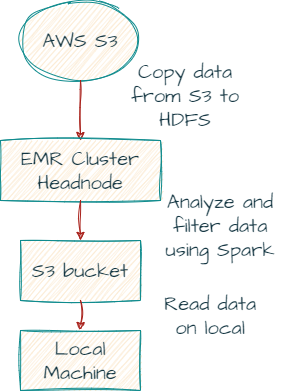

# Big Data Wrangling with Google Books Ngrams

The scope of this data processing and analysis report is to document the workflow involved in filtering and reducing big data of Google Ngrams down to a manageable size, and then doing some analysis locally on our machine after extracting data.
The Google Ngrams dataset was created by Google's research team by analyzing all of the content in Google Books - these digitized texts represent approximately 4% of all books ever printed, and span a time period from the 1800s into the 2000s. The Google Ngram Viewer or Google Books Ngram Viewer is an online search engine that charts the frequencies of any set of search strings using a yearly count of n-grams found in printed sources published between 1500 and 2019.
The dataset is hosted in a public S3 bucket as part of the Amazon S3 Open Data Registry. This data has been converted to CSV and hosted on a public S3 bucket.

This repo consists of the following files:
1. read-data-from-s3bucket-local_jupyter_notebook.ipynb -This jupyter notebook reads data from the S3 bucket in the local system.
2. spark_notebook - spark notebook to be run on EMR cluster and doing analysis on Google Books Ngram data.
3. report_steps - pdf which consists of setting up an EMR cluster and reading data from the S3 bucket on the local system.
